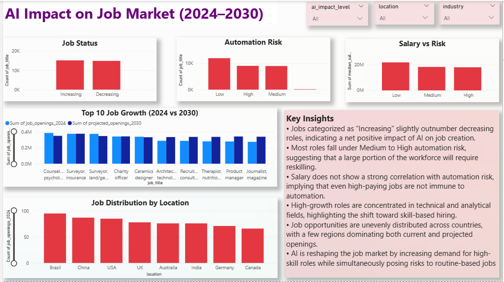
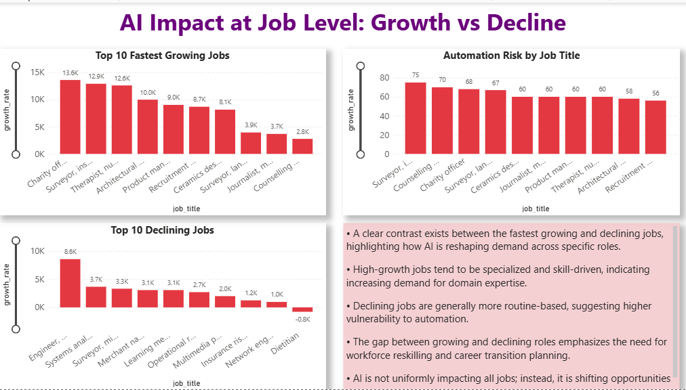

# 🤖 AI Impact on Job Market (2024–2030)

A data-driven analysis exploring how Artificial Intelligence is transforming job demand, automation risk, and workforce trends across industries.

---

## 📊 Project Overview

This project analyzes the impact of AI on the job market by identifying:

- 📈 Growing vs declining jobs  
- ⚠️ Automation risk across roles  
- 💰 Relationship between salary and automation  
- 🌍 Job distribution across locations  
- 🔍 Job-level impact (top growing & declining roles)  

The goal is to understand how AI is reshaping employment and what it means for future workforce planning.

---

## 🧰 Tools & Technologies

- **Python** → Data cleaning & preprocessing  
- **Power BI** → Interactive dashboard & visualization  

---

## 📁 Dataset

- AI Job Market Dataset (analysis dataset)  
- Includes:
  - job_title  
  - job_status  
  - growth_rate  
  - automation_risk  
  - risk_category  
  - median_salary  
  - location  

---

## 📊 Dashboard Structure

### 🔹 Page 1 — Market Overview
- Job Status (Increasing vs Decreasing)
- Automation Risk Distribution
- Salary vs Risk Analysis
- Top 10 Job Growth (2024 vs 2030)
- Job Distribution by Location

### 🔹 Page 2 — Job-Level Impact Analysis
- 🚀 Top 10 Fastest Growing Jobs  
- 📉 Top 10 Declining Jobs  
- ⚠️ Automation Risk by Job Title

---

## 🔍 Key Insights

- AI is creating slightly more jobs than it is replacing, indicating a **net positive impact**
- Most roles fall under **medium to high automation risk**, highlighting the need for reskilling
- High salary does **not guarantee protection** from automation
- High-growth roles are **skill-based and specialized**
- Declining roles are **routine and repetitive**
- AI is **shifting job demand**, not eliminating it

---

## 💡 Business Impact

- Organizations must invest in **reskilling programs**
- Workforce strategies should focus on **high-skill roles**
- Individuals should shift toward **analytical and technical skills**
- Companies need to prepare for **AI-driven workforce transformation**

---

## 🚀 Future Improvements

- Add industry-wise analysis  
- Include time-series forecasting  
- Build predictive model for job growth  
- Deploy dashboard online (Power BI Service)  

---

